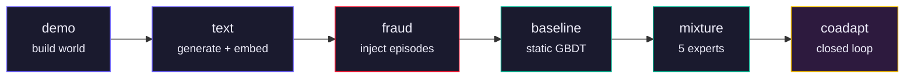

# GAUNTLET

**Closed-loop adversarial simulation for GenAI-enabled payment fraud.**

GAUNTLET is a red-team/blue-team system that invents GenAI payment fraud, simulates it against a synthetic bank, and trains a detector that catches it, all as one closed loop where attacker and defender adapt against each other. The attacker is a reinforcement-learning agent that discovers fraud strategies on its own. The defender is a mixture of five specialized experts. When the defender improves, the attacker finds new gaps; when the attacker escalates, the defender refits. The result is a continuously hardening detection model, not a static classifier trained on a frozen dataset.

> Mastercard Innovation Challenge 2026 | AI Defense Lab for Payment Security
> Team **Band of the Hawk**, IIT Kharagpur

## Solution Document

The full write-up: the attacks identified, how they are generated and simulated, the
detection and mitigation model with its efficacy results, and real-world feasibility.

- **[docs/BandOfTheHawk.pdf](docs/BandOfTheHawk.pdf)** — 26 pages, the readable version
- **[docs/BandOfTheHawk.docx](docs/BandOfTheHawk.docx)** — the same document as submitted

Section 8 carries the results this repository reproduces, Appendix B the configuration
every reported run used, and Appendix D the commands to re-run them.

## Working Prototype

**https://gauntlet-eight-theta.vercel.app**

A live operations console built from one real 63.7-minute run. Six views, one per judged
criterion, behind a landing page:

| View | Shows |
|------|-------|
| Architecture | One pass of the closed loop. Attack and benign traffic converge on a single event builder, which is the blindness rule made visible. Every stage expands to its mechanics. |
| Dashboard | The arms race across 150 updates with all 12 defender refits, the attacker strategy stream, expert weights, risk bands to mitigation, and the five-way detector comparison. |
| Simulator | Calibration expressed as ratios against the noise floor of real data split against itself, the eight rule trigger rates, hard-negative composition, and fan-out variance to mean. |
| The Loop | Selectable refit markers, the entropy spike that forces re-exploration, and the final trained policy at full length. |
| Live | Authorisations scoring against the real cost bands, each row expanding to show why. |
| Demo | Attack explorer across all 11 identified verticals, scripted attacker against learned. |

Every figure comes from `run.log` and the committed calibration artifacts. Two things are
labelled rather than presented as measured: precision, recall and F1 at the alert budget are
marked `derived`, because `DetectionMetrics` does not compute F1; and the authorisation stream
samples individual events from fitted distributions, which the panel states on itself. The cost
curve is labelled relative cost, never a currency figure.

The prototype does not drive the pipeline. A full run is six stages and 3819 seconds on a GPU
server, so it replays one real run rather than pretending to launch another.

## Key Results

Two regimes are reported and they are not interchangeable. Static benchmarks run at 12,000
cardholders against the fixed scripted red team, which is what makes an architectural
ablation interpretable. Co-adaptation runs at 600 cardholders across four paired seeds,
because that regime needs many independent runs rather than one large one.

**Static detection, `--profile server`**

| Metric | Value |
|--------|-------|
| Flat GBDT PR-AUC | 0.9879 |
| Flat GBDT ROC-AUC | 0.9998 |
| Recall @ 0.1% FPR | 0.9727 |
| Rule-engine PR-AUC (the baseline it beats) | 0.0266 |
| Learned combiner over fixed average | +0.0108 PR-AUC |
| Per-entity feature ablation | +0.0003 PR-AUC (a null result, reported as it came out) |

**Co-adaptation, `--profile ablation`, four paired seeds**

| Metric | Value |
|--------|-------|
| Stealth ablation, mean paired difference | +1639, 95% CI [+219, +2764] |
| Runs showing full co-evolution | 5 of 8 |
| Genuine authorisations refused | 0.67% |

Removing the attacker's posture head and multi-card dump costs it 1,639 in mean post-refit
extraction, and the bootstrap interval excludes zero. Four seeds is a small sample, one
seed runs the other way, and an interval of this width would not detect an effect much
smaller than the one measured. The co-evolution itself appears in both arms, so it is a
property of the loop rather than of any one attacker capability.

The defender is measured on what it costs as well as what it catches: 0.67% of genuine
authorisations refused. Without that, the cheapest winning move is to refuse everything.

**Taxonomy**

| Metric | Value |
|--------|-------|
| Attack families simulated | 9, of which 2 are held out of training |
| Attack families identified | 11 (merchant collusion and bust-out described, not simulated) |

**Zero-shot recall is not reported.** SIM swap is designated a held-out vertical, but the
SIM swap action is also legal in the learned attacker's action space and the policy uses
it. The defender therefore trains on SIM swap traffic and is then asked whether it
generalises to SIM swap. High recall could not be credited to generalisation and low
recall could not be blamed on it, so the measurement is withheld rather than explained
away. Removing the held-out actions from the learned attacker's legality mask would
restore it.

## Architecture

The pipeline runs six stages in order:



| Stage | What it does |
|-------|-------------|
| `demo` | Build and warm-start a synthetic bank: 12k cardholders, entity graph, per-card behavioral calibration |
| `text` | Generate dispute letters and embed them with Qwen3-Embedding-0.6B |
| `fraud` | Inject scripted fraud episodes across the 7 training verticals at a realistic base rate. The 2 held-out families never appear here; they are first seen at evaluation, which is what makes the zero-shot number zero-shot |
| `baseline` | Fit a flat gradient-boosted detector as a static benchmark |
| `mixture` | Fit 5 specialized experts (transaction, binding, identity, network, text) and a combiner |
| `coadapt` | The closed loop: warm-start defender and RL attacker, then run live co-adaptation |

The package installs as one runtime base plus five optional extras, so the simulation
path stays fast and every ML layer is isolated behind its own install:

| Tier | Extra | Brings | Covers |
|------|-------|--------|--------|
| Runtime | *(base)* | numpy, scipy, pydantic, pyyaml | The whole simulation: world, population, timing, behavior, features, engine, rules |
| Defender | `defender` | scikit-learn, xgboost | The five experts, the combiner, the flat baseline |
| RL | `rl` | torch | The learned attacker and PPO |
| Generative | `generative` | torch, transformers, accelerate, sentence-transformers | Text generation and embeddings |
| Calibration | `calibration` | pandas, pyarrow | Fitting parameters from real data |
| Analysis | `analysis` | networkx, matplotlib | Graph metrics and plots |

The runtime tier is the load-bearing claim: the simulation runs on numpy alone, with no
ML library installed. An AST-level import firewall (`tests/test_import_firewall.py`)
enforces it by walking the source of every runtime module, function bodies included, so
even a lazy `import torch` fails the check. CI runs the suite once with nothing optional
installed to prove it.

## Quickstart

**Requirements:** Python 3.13+. No GPU is needed to reproduce the pipeline: the text
corpus is the only part that wants one, and it ships prebuilt in `artifacts/`.

**Data:** the fitted parameters, noise floors and text corpus ship with this repo, so the
system runs on a clone alone. The public source datasets are not redistributed here and
live in Drive:

**https://drive.google.com/drive/folders/1c1J4jxLpswAmu3te7RlfK2BGwQIV4SLT**

Take `1-gauntlet-data-runtime.zip` (211 MB) and unzip it so `Dataset/` sits beside
`main.py`, or set `GAUNTLET_DATASET` to wherever you put it. Take
`2-gauntlet-data-full.zip` (657 MB) instead only if you want to refit calibration from
scratch; it is a superset.

That one download matters more than it looks. Exactly one file,
`Dataset/complaints/cfpb_payments_all.parquet`, is read while the system runs: it supplies
the real complaint narratives the text scorer compares generated ones against. **Without
it the pipeline still runs and still exits 0**, silently scoring the generated corpus
against itself instead, which moves the text expert's inputs and the detector's scores
without reporting anything. Check it is wired up before trusting a run:

```bash
python -c "from fraudsim.paths import DEFAULT_CFPB; print(DEFAULT_CFPB.exists())"
```

```bash
# Clone
git clone https://github.com/wildcraft958/BandOfTheHawk.git
cd BandOfTheHawk

# Install (GPU, recommended)
python -m venv .venv && source .venv/bin/activate
pip install torch --index-url https://download.pytorch.org/whl/cu130
pip install -r requirements.txt
pip install -e .

# Install (CPU only)
python -m venv .venv && source .venv/bin/activate
pip install -r requirements.txt
pip install -e .

# Install (simulation only, no learned tiers)
# The runtime is numpy-only; the detectors, the RL attacker and the text
# models are optional extras. Tests that need one skip without it.
pip install -e ".[dev]"

# Run the full pipeline
python main.py                     # the default profile
python main.py --profile server    # 12k holders, 150 updates: the static benchmarks
python main.py --profile quick     # a fast smoke of every stage

# Run a single stage
python main.py baseline

# The stealth ablation: the four paired seeds behind the reported comparison
for s in 0 1 2 3; do
  python main.py coadapt --profile ablation --seed $s
  python main.py control --profile ablation --seed $s
done
python -m fraudsim.orchestration.ablation
python make_figures.py             # regenerates the five measured figures

# Run tests
pytest tests/ -q
```

Profiles set sizes and never which stages run or what they print. There are five:
`quick`, `ablation`, `default`, `gpu` and `server`. A bare `python main.py` runs
`default`; every static detection benchmark comes from `server`; the paired co-adaptation
comparison comes from four seeds under `ablation`, which fixes 600 cardholders, 24 updates
and a refit every 6.

A seeded `coadapt` or `control` run files its own metrics into `artifacts/ablation/` under
the name the ablation reader expects, so the commands above work in that order with
nothing copied by hand. The reader recomputes the paired comparison and its bootstrap
interval from those stored files, and `make_figures.py` draws the figures from the same
files, taking its statistics from the ablation module rather than recomputing them, so a
figure and the number quoted beside it cannot drift apart. It needs the analysis extra
(`pip install -e ".[analysis]"`).

No GPU is needed. The text corpus ships prebuilt in `artifacts/` and is reused rather than
regenerated; pass `--rebuild` to `fraudsim.generative.cli` to build it from scratch, which
is the one step that genuinely wants one.

The package must be installed (`pip install -e .`) before anything runs: the
code lives under `src/`, so it is not importable from the checkout alone.

On macOS with both torch and xgboost installed, the two bring separate copies of libomp,
and loading both into one process segfaults. `tests/conftest.py` detects this and fails
the run with the fix rather than crashing, but the pipeline itself will simply die at the
`baseline` stage, so export this first:

```bash
export DYLD_LIBRARY_PATH="$(python -c 'import torch,os;print(os.path.join(os.path.dirname(torch.__file__),"lib"))')"
```

Set it in the shell that runs the command. Wrappers in `/usr/bin` (`/usr/bin/time`,
`/usr/bin/env`) are protected by System Integrity Protection and strip `DYLD_*` from
anything they launch, so the variable has to reach Python directly. Linux is unaffected.

## Fraud Taxonomy

Nine simulated attack families, each a distinct path through the 20-action space. The
last two are withheld from training entirely, so the `fraud` stage injects the first
seven and the detector meets `sim_swap` and `refund_abuse` for the first time at
evaluation:

| # | Vertical | GenAI capability required |
|---|----------|--------------------------|
| 1 | `card_testing` | Credential generation at scale |
| 2 | `phishing_ato` | Personalized phishing with voice/text |
| 3 | `deepfake_onboarding` | Synthetic identity documents |
| 4 | `voice_clone` | Real-time voice cloning for phone auth |
| 5 | `friendly_fraud` | Generated dispute letters grounded in facts |
| 6 | `mule_layering` | Automated money movement across mule networks |
| 7 | `support_se` | Social engineering of support agents |
| 8 | `sim_swap` | Coordinated SIM hijacking (held out of training) |
| 9 | `refund_abuse` | Fabricated return claims (held out of training) |

Two further families, `merchant_collusion` and `bust_out`, are identified and described
but deliberately not simulated, which is what makes the count 11 identified against 9
simulated. Both need a settlement and clawback model this system does not implement, so
the actions they would require are absent from the action space by design, and a test
(`tests/test_engine.py`) asserts they stay absent rather than half-present.

## Directory Structure

Two names, two meanings, no overlap: `configs/` holds the data, `fraudsim/settings/`
holds the code that reads it.

```
BandOfTheHawk/
├── main.py                      # Pipeline entrypoint (all stages, or one)
├── make_figures.py              # Regenerates the five measured figures
├── docs/                        # The solution document, as PDF and .docx
├── pyproject.toml               # The dependency contract: base + five extras
├── requirements.txt             # One exact set of versions, verified together
├── configs/                     # The data. Plain YAML, no code.
│   ├── simulation.yaml          # Population, engine, behavior, detector, training
│   ├── profiles.yaml            # The four run sizes
│   └── logging.yaml             # The two output channels
├── src/
│   └── fraudsim/                # Core package (~19k lines)
│       ├── paths.py             # Every filesystem path, resolved in one place
│       ├── cli.py               # Shared argument parsing and config loading
│       ├── logs.py              # Report channel (stdout) vs diagnostics (stderr)
│       ├── taxonomy.py          # The vertical registry: one definition per family
│       ├── clock.py  ids.py  rng.py  protocols.py
│       ├── settings/            # The loader: pydantic models and provenance
│       │
│       │   # runtime tier: numpy only, enforced by the import firewall
│       ├── world/               # Entity graph: holders, cards, devices, merchants
│       ├── population/          # Population builder, archetypes, warm start
│       ├── timing/              # Circadian rhythms, arrival processes
│       ├── behavior/            # Per-card amount models, loyalty patterns
│       ├── features/            # Per-entity feature extraction, column registry
│       ├── engine/              # Simulation loop, action resolution, outcomes
│       ├── rules/               # Velocity rules, naive detection baseline
│       │
│       │   # optional tiers: firewall-exempt, each behind its own extra
│       ├── calibration/         # Fit distributions to real data, noise floors
│       ├── defender/            # 5 experts, combiner, cost-curve bands
│       ├── attacker/            # Scripted attacks + RL agent (PPO)
│       ├── generative/          # Text generation (Qwen), embeddings, scoring
│       ├── orchestration/       # Episode runner, co-adaptation loop, ablation
│       └── analysis/            # Graph snapshots, entity reports
├── tests/                       # 42 test files; conftest.py skips absent tiers
├── .github/workflows/ci.yml     # Lint, both tiers, and a reproducibility check
└── artifacts/                   # Calibration outputs from a real pipeline run
    ├── fitted_params.json
    ├── noise_floors.json
    └── text_pool.json
```

A run also writes `artifacts/coadapt_metrics.json` and `artifacts/checkpoints/`. Both are
generated, so both are gitignored; the committed artifacts above are the calibration
inputs a fresh clone needs, not run outputs.

## Team

**Band of the Hawk** | IIT Kharagpur

- Shehryaar Shah Khan
- Animesh Raj
- Saksham Tiwari
- Eisa Shaiju
- Monika Kumari

## License

MIT. See [LICENSE](LICENSE).
