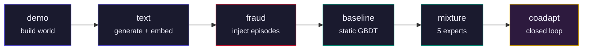

# GAUNTLET

**Closed-loop adversarial simulation for GenAI-enabled payment fraud.**

GAUNTLET is a red-team/blue-team system that invents GenAI payment fraud, simulates it against a synthetic bank, and trains a detector that catches it, all as one closed loop where attacker and defender adapt against each other. The attacker is a reinforcement-learning agent that discovers fraud strategies on its own. The defender is a mixture of five specialized experts. When the defender improves, the attacker finds new gaps; when the attacker escalates, the defender refits. The result is a continuously hardening detection model, not a static classifier trained on a frozen dataset.

> Mastercard Innovation Challenge 2026 | AI Defense Lab for Payment Security
> Team **Band of the Hawk**, IIT Kharagpur

## Key Results

| Metric | Value |
|--------|-------|
| Flat GBDT PR-AUC | 0.9879 |
| Flat GBDT ROC-AUC | 0.9998 |
| Recall @ 0.1% FPR | 0.9727 |
| Zero-shot recall (held-out verticals) | 1.000 |
| Co-adaptation updates | 150 |
| Defender refits during co-adaptation | 12 |
| Attack families simulated | 9 (+ 2 held out of training) |
| Full pipeline runtime | 63.7 min |

Zero-shot recall means the detector catches attack types it has never seen in training. Two verticals (SIM swap and refund abuse) are withheld entirely and still detected at 100% recall.

## Architecture

The pipeline runs six stages in order:



| Stage | What it does |
|-------|-------------|
| `demo` | Build and warm-start a synthetic bank: 12k cardholders, entity graph, per-card behavioral calibration |
| `text` | Generate dispute letters and embed them with Qwen3-Embedding-0.6B |
| `fraud` | Inject scripted fraud episodes across 7 verticals at a realistic base rate |
| `baseline` | Fit a flat gradient-boosted detector as a static benchmark |
| `mixture` | Fit 5 specialized experts (transaction, binding, identity, network, text) and a combiner |
| `coadapt` | The closed loop: warm-start defender and RL attacker, then run live co-adaptation |

Three dependency tiers keep the simulation path fast and the ML layers isolated:

- **Runtime** (numpy, scipy, pydantic): the simulation engine, zero ML imports
- **Defender** (scikit-learn, xgboost): the detection models
- **RL + Generative** (torch, transformers, sentence-transformers): the learned attacker and text generation

An AST-level import firewall (`tests/test_import_firewall.py`) enforces these boundaries at test time.

## Quickstart

**Requirements:** Python 3.13+, CUDA GPU recommended for the text stage (CPU works but slower).

```bash
# Clone
git clone https://github.com/wildcraft958/BandOfTheHawk.git
cd BandOfTheHawk

# Install (GPU, recommended)
python -m venv .venv && source .venv/bin/activate
pip install torch --index-url https://download.pytorch.org/whl/cu130
pip install -r requirements.txt

# Install (CPU only)
python -m venv .venv && source .venv/bin/activate
pip install -r requirements.txt

# Run the full pipeline
python main.py --profile server    # GPU, 12k holders, ~64 min
python main.py --profile fast      # CPU, smaller population, ~10 min

# Run a single stage
python main.py baseline
python main.py coadapt --profile server

# Run tests
pytest tests/ -x -q
```

## Fraud Taxonomy

Nine attack families, each a distinct path through the 20-action space:

| # | Vertical | GenAI capability required |
|---|----------|--------------------------|
| 1 | `card_testing` | Credential generation at scale |
| 2 | `phishing_ato` | Personalized phishing with voice/text |
| 3 | `deepfake_onboarding` | Synthetic identity documents |
| 4 | `voice_clone` | Real-time voice cloning for phone auth |
| 5 | `friendly_fraud` | Generated dispute letters grounded in facts |
| 6 | `mule_layering` | Automated money movement across mule networks |
| 7 | `support_se` | Social engineering of support agents |
| 8 | `sim_swap` | Coordinated SIM hijacking (held out of training) |
| 9 | `refund_abuse` | Fabricated return claims (held out of training) |

A tenth (`merchant_collusion`) is documented but deliberately not simulated. It requires a settlement and clawback model this system does not implement.

## Directory Structure

```
BandOfTheHawk/
├── main.py                  # Pipeline entrypoint (run all stages or one)
├── pyproject.toml           # Package metadata and dependency tiers
├── requirements.txt         # Pinned versions for reproducibility
├── configs/
│   └── simulation.yaml      # Population size, profiles, stage parameters
├── fraudsim/                # Core package (~18k lines)
│   ├── world/               # Entity graph: holders, cards, devices, merchants
│   ├── population/          # Population builder, archetypes, warm-start
│   ├── timing/              # Circadian rhythms, arrival processes
│   ├── calibration/         # Fit distributions to real data, noise floors
│   ├── features/            # Per-entity feature extraction (numpy only)
│   ├── engine/              # Simulation loop, action resolution, outcomes
│   ├── rules/               # Velocity rules, naive detection baseline
│   ├── behavior/            # Per-card amount models, loyalty patterns
│   ├── attacker/            # Scripted attacks + RL agent (PPO)
│   ├── defender/            # 5 experts, combiner, cost-curve bands
│   ├── generative/          # Text generation (Qwen), embeddings, scoring
│   ├── orchestration/       # Pipeline stages, co-adaptation loop, ablation
│   ├── analysis/            # Graph snapshots, entity reports
│   └── config/              # YAML loading, profile selection
├── tests/                   # 30 test files, import firewall, smoke tests
├── artifacts/               # Calibration outputs from a real pipeline run
│   ├── fitted_params.json
│   ├── noise_floors.json
│   └── text_pool.json
└── web/                     # Web prototype
```

## Team

**Band of the Hawk** | IIT Kharagpur

- Shehryaar Shah Khan
- Animesh Raj
- Saksham Tiwari
- Eisa Shaiju
- Monika Kumari

## License

MIT. See [LICENSE](LICENSE).
